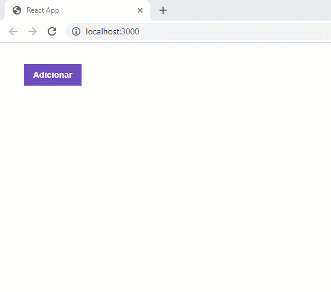

# React JS - A simple test project 

Exercise on ReactJS for the Bootcamp GoStack - Rocketseat.

Add a record in the backend by clicking the button "Adicionar".

To install all dependencies:

```
yarn
```

To run the project:

```
yarn start
```

### Node.js back-end for this project:

[simple-test-project-variation-nodejs](https://github.com/rlovatto/simple-test-project-variation-nodejs)


<br/><br/>



